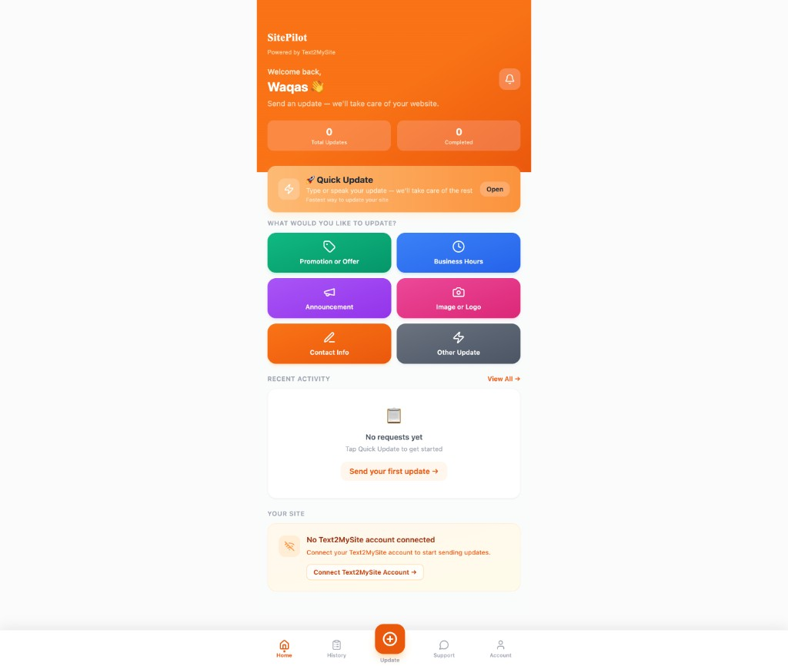
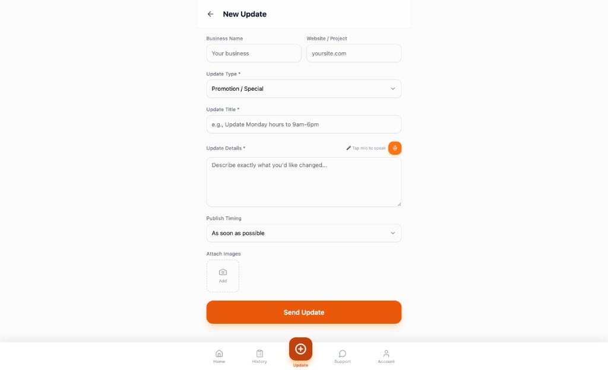
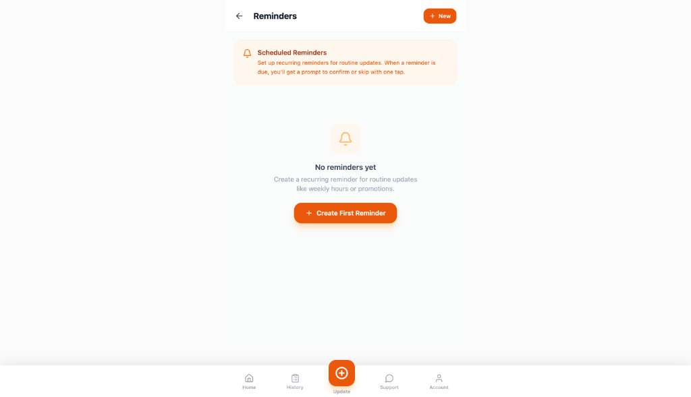
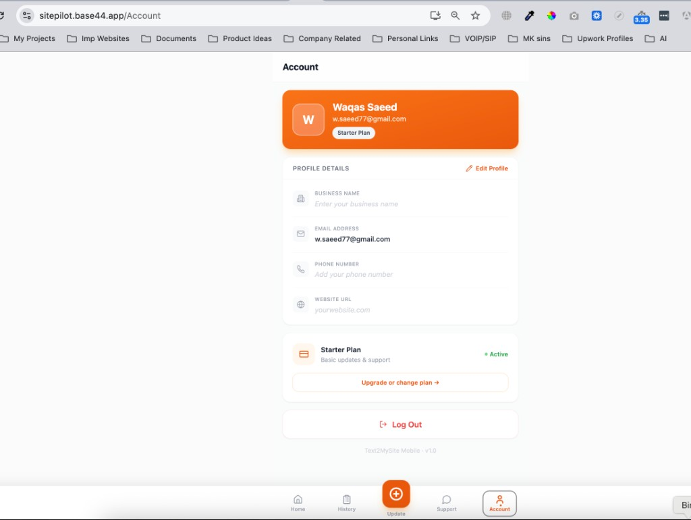

# SitePilot (Base44) — Screenshot Reference

**Live app:** [sitepilot.base44.app](https://sitepilot.base44.app/)  
**Related discovery:** Ciony’s “SitePilot customer update/request layer” (see `../../docs/BASE44_DISCOVERY_NOTE.md`, `../../docs/BASE44_DISCOVERY_REPORT.md` in the parent repo)  
**Aligned product doc:** `../../docs/VERSION_1_FINALIZED_BUILD_SCOPE.md`  
**Companion reference:** [DIY Announcement Builder](./DIY_ANNOUNCEMENT_BUILDER_SCREENSHOTS.md) (hosted page / builder concepts)

---

## Screenshots captured (May 24, 2026)

Mobile-first UI from the live Base44 app. Stored under **`t2ms-hosted/docs/assets/sitepilot/`**:

| Screen | Route / feature | Reference image |
|--------|-----------------|-----------------|
| Dashboard | Home — welcome, stats, Quick Update, category shortcuts, recent activity, account connection |  |
| New Update | New request form — business/site, update type, title, details, voice mic, images, Send Update |  |
| Reminders | Scheduled recurring reminders (empty state) |  |
| Account | Profile, plan badge, business/phone/website, subscription, log out |  |

Direct file links:

- [dashboard.png](./assets/sitepilot/dashboard.png)
- [new-update.png](./assets/sitepilot/new-update.png)
- [reminders.png](./assets/sitepilot/reminders.png)
- [account.png](./assets/sitepilot/account.png)

---

## What this app is

SitePilot is a **customer-facing update/request app** (“Powered by Text2MySite”), not a hosted-page builder. Customers submit changes; the app tracks request history and connection state to T2MS.

From the Base44 feature outline (`Waqas-TEXT2MYSITE - SitePilot App - Base44.pdf`):

| Area | SitePilot (Base44) | T2MS Version 1 (finalized) |
|------|-------------------|----------------------------|
| Dashboard + Quick Update | Yes | **Reuse concept** — primary action, low friction |
| Category shortcuts (Promotion, Hours, Announcement, etc.) | Yes | **Reuse selectively** — shortcuts for first update / demos |
| Request history + detail + follow-up notes | Yes | **Defer** — keep live text/update simple for V1 |
| Account summary + connection states | Yes | **Reuse concept** — setup/not connected/ready |
| Voice dictation on update form | Yes | **Optional later** — not required for V1 launch |
| Reminders + recurring schedules | Yes | **Defer** |
| Help center / FAQ / support tickets | Yes | **Defer** |
| Full request-management backend | Yes (partially mocked) | **Do not reuse directly** |

---

## Screen-by-screen notes (from captures)

### Dashboard

- Personalized greeting and **Total Updates / Completed** stats.
- **Quick Update** bar — prominent path to submit without navigating deep menus.
- **Six category tiles** pre-fill update intent (Promotion, Business Hours, Announcement, Image/Logo, Contact Info, Other).
- **Recent activity** empty state with CTA (“Send your first update”).
- **Account summary** block: “No Text2MySite account connected” with connect CTA — clear **setup/connection state** pattern.
- Bottom nav: Home, History, **Update (+)** as elevated primary action, Support, Account.

**V1 takeaway:** Strong primary action, shortcuts to reduce blank-state friction, visible connection/setup status.

### New Update

- Business name + website/project fields.
- Update type dropdown, title, details (with **tap mic to speak**).
- Publish timing (e.g. ASAP).
- Image attach.
- **Send Update** as single primary CTA.

**V1 takeaway:** Simple structured update form; for hosted pages, map to “publish announcement” rather than full request ticketing.

### Reminders

- Recurring reminder list + “Create First Reminder”.
- Explains scheduled prompts for routine updates.

**V1 takeaway:** **Defer** for Version 1 (agreed in discovery).

### Account

- Profile hero (avatar initial, name, email, **Starter Plan** badge).
- Editable business name, phone, website URL; email read-only.
- Plan card with **Active** status and upgrade path.
- Log out.

**V1 takeaway:** Profile + plan visibility; business/website fields align with hosted-page identity setup.

---

## Concepts worth harvesting for T2MS (patterns only)

1. **One obvious primary action** — center “Update” in nav; Quick Update on dashboard.
2. **Category shortcuts** — faster first update for churches/outreach demos.
3. **Setup/connection summary** — not connected vs starter vs fully connected.
4. **Simple status visibility** — counts and recent activity without a heavy ticket system.
5. **Account/profile as home for identity** — business name, phone, website link (maps to “Return to Main Website” on hosted page).

---

## Explicitly not carried into Version 1 from SitePilot

- Full request history, detail pages, and follow-up note threads as core product
- Reminder engine and due-reminder overlays
- Support center, FAQ accordion, contact-support entity flows
- Mocked T2MS dispatch layer as technical foundation
- Replacing T2MS onboarding with SitePilot’s full app shell

---

## T2MS codebase overlap

SitePilot informs **customer UX and onboarding clarity** in the parent MVP app, not a separate mobile app for V1:

- Onboarding / install flows (`../../docs/GET_INSTALLED_WIDGET_FLOW.md`)
- Messaging and live updates (Twilio routes, app dashboard)
- Hosted-page path: connection state + “you’re ready to share your link”

---

## Next steps (optional)

- [x] Screenshots stored in `t2ms-hosted/docs/assets/sitepilot/`
- [ ] Capture History + Request Detail screens if needed for deferred-phase reference
- [ ] Map dashboard “connection states” to T2MS hosted-page onboarding copy

---

*Prepared by Waqas — references client thread, Base44 PDF spec, and live app captures at sitepilot.base44.app.*
